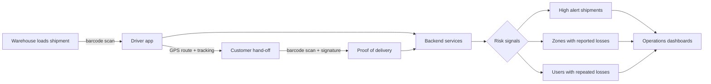
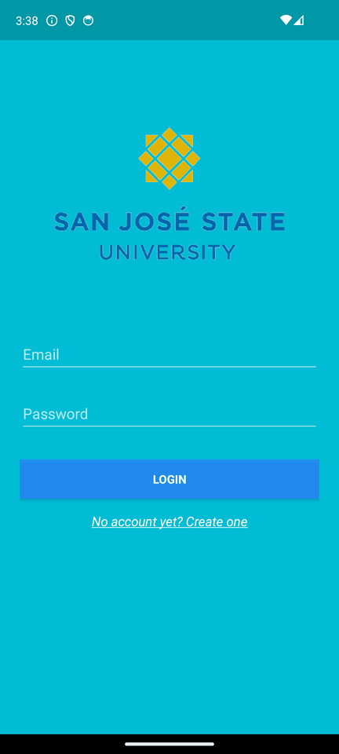
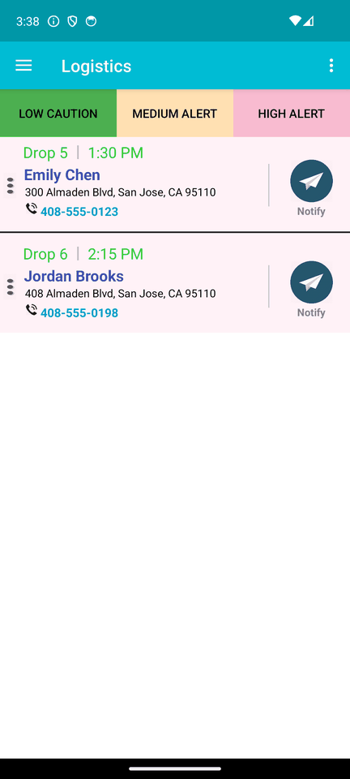
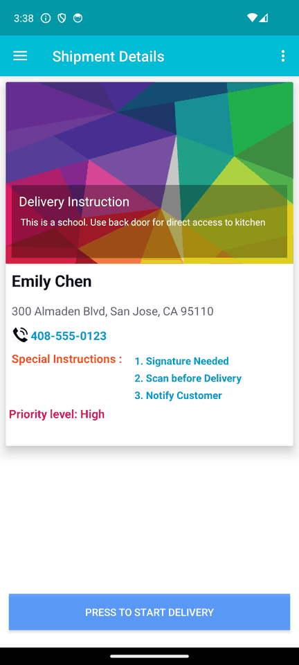
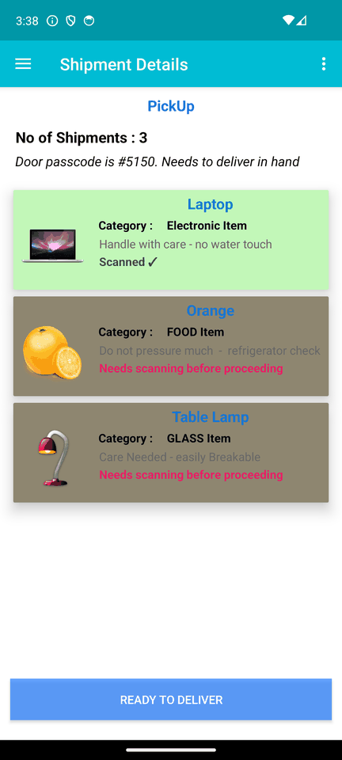
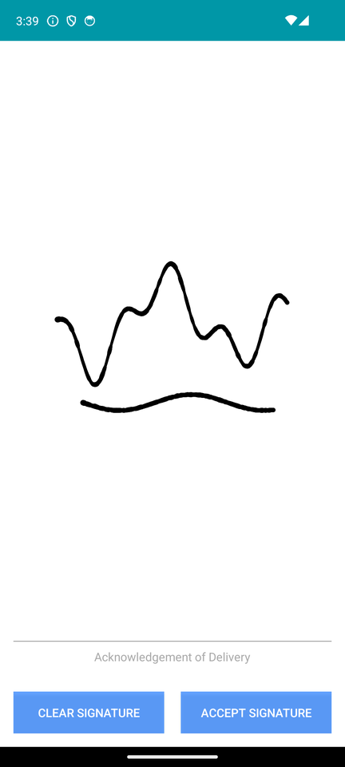
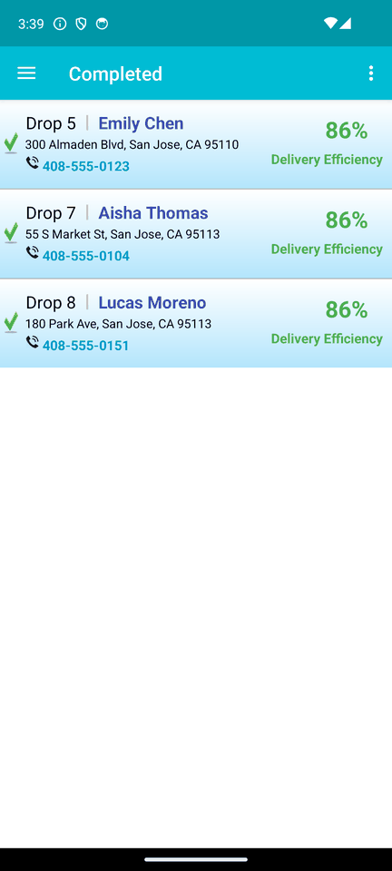
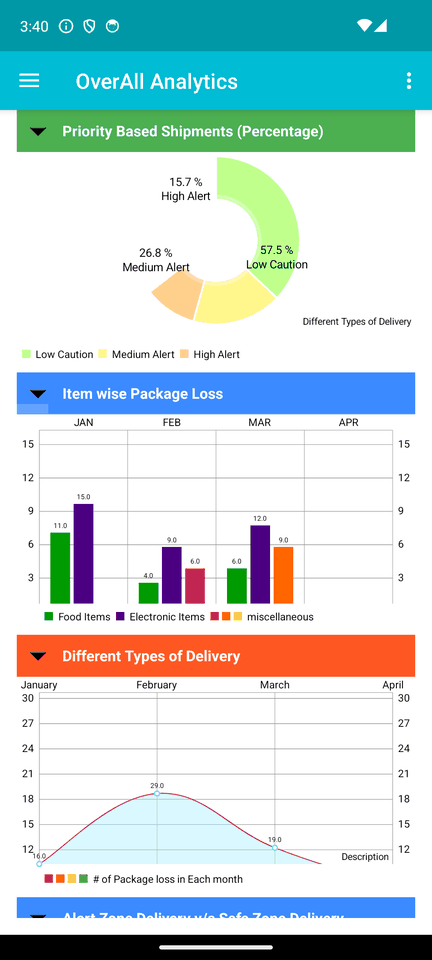
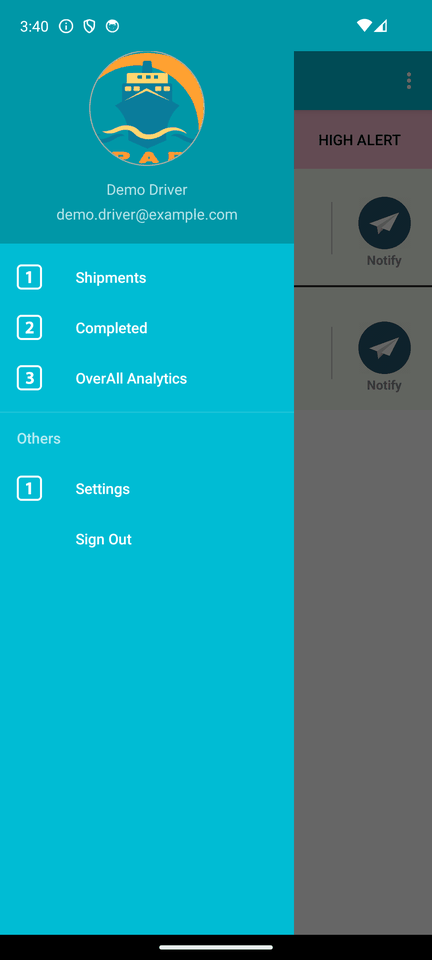

<h1 align="center">📦 Retail Loss Prevention (LPARI)</h1>

  <b>Loss Prevention Analytics for the Retail Industry</b> 
  A delivery-loss detection system: a driver app that proves every hand-off, 
  a backend that flags risky shipments and zones, and dashboards for the operations team.

  
  
  
  

## The problem

Packages go missing between the warehouse and the customer's door: lost in transit, mis-delivered, or claimed as "never arrived". Without proof at each hand-off, a retailer can't tell a genuine loss from a fraudulent claim, and can't see where losses cluster.

LPARI records evidence at every step of the delivery and turns it into risk signals.

## How it works

- **Proof at every hand-off**: packages are barcode-scanned at loading and delivery, and the customer signs on the device.
- **Location evidence**: GPS tracking and map routing for each trip.
- **Risk tiers**: shipments are sorted into **high alert**, **medium alert** and **low caution** so drivers and operations focus on the risky ones first.
- **Loss analytics**: the backend surfaces **zones with reported package losses** and **users with repeated losses**, the patterns that separate real loss from fraud.

## Screenshots

The driver app (`android-logistics-app`), running on Android 14 in demo mode with fictional sample data.

| Sign in | Drops by risk | Shipment details | Scan each package |
|:---:|:---:|:---:|:---:|
|  |  |  |  |
| **Proof of delivery** | **Completed** | **Loss analytics** | **Navigation** |
|  |  |  |  |

## What's in this repository

Five repositories from the project, combined here with their full commit history.

| Folder | What it is | Built by |
|---|---|---|
| [`android-logistics-app`](android-logistics-app) | The full driver app: trip list, shipments grouped by alert level (high, medium, low), shipment details, barcode scanning, signature capture, GPS routing, analytics charts, backend calls via Retrofit | Santanu Chakraborty |
| [`android-delivery-app-v1`](android-delivery-app-v1) | First version of the delivery app: sign-up and login, shipment list, item-by-item delivery with slide-to-confirm, barcode scanning, signature capture, GPS | Santanu Chakraborty |
| [`backend-services`](backend-services) | JAX-RS REST services over MySQL: package status, delivery history, alert zones, red-alert users | Nagashruthi |
| [`admin-dashboard`](admin-dashboard) | Operations dashboard, built on the open-source *SuperAdmin* template | Santanu Chakraborty |
| [`web-dashboard`](web-dashboard) | Web dashboard for the CMPE 295B demo, built on an open-source admin template | Santanu Chakraborty |

## Tech stack

| Layer | Technology |
|---|---|
| Mobile | Android (Java, AndroidX), Retrofit 2 + OkHttp 4, Gson, ZXing barcode scanner, SignaturePad, Google Maps, MPAndroidChart |
| Backend | Java, JAX-RS (Jersey), MySQL, Maven |
| Cloud | AWS Elastic Beanstalk (sign-up service); mocky.io mock APIs during development |
| Web | HTML, CSS, JavaScript, Bootstrap admin templates |

## Status

This was the capstone project for the M.S. in Software Engineering at San José State University (CMPE 295A/B), completed in 2016.

**The driver app (`android-logistics-app`) was brought up to date in 2026** and builds and runs on current Android: Gradle 8.7, Android Gradle Plugin 8.5, target SDK 34, AndroidX, Retrofit 2. The 2016 backend and mock endpoints no longer exist, so it ships with a **demo mode** that answers API calls from bundled sample data; point it at a real server with one line in `local.properties`. The modernization also fixed real defects: passwords sent in plain-HTTP URLs and printed to the log, texts sent silently without the user seeing them, a Completed tab that listed *pending* drops, and a signature save that Android 10+ blocks. See [`android-logistics-app/README.md`](android-logistics-app/README.md).

The other folders are kept as a record of that work and are **not maintained**: `android-delivery-app-v1` still targets 2016 SDKs, and the backend expects a local MySQL database.

Looking back, the parts I'd change first are the ones that matter most at scale: move database credentials into configuration, replace the hard-coded alert tiers with a scoring model, and stream delivery events instead of polling for them. Real-time risk decisioning is what I went on to build professionally.

## Credits

Built at San José State University with **Nagashruthi**, who wrote the backend services (26 of the 29 commits in `backend-services`). The two dashboards are built on open-source admin templates, whose original licenses apply to that template code.
